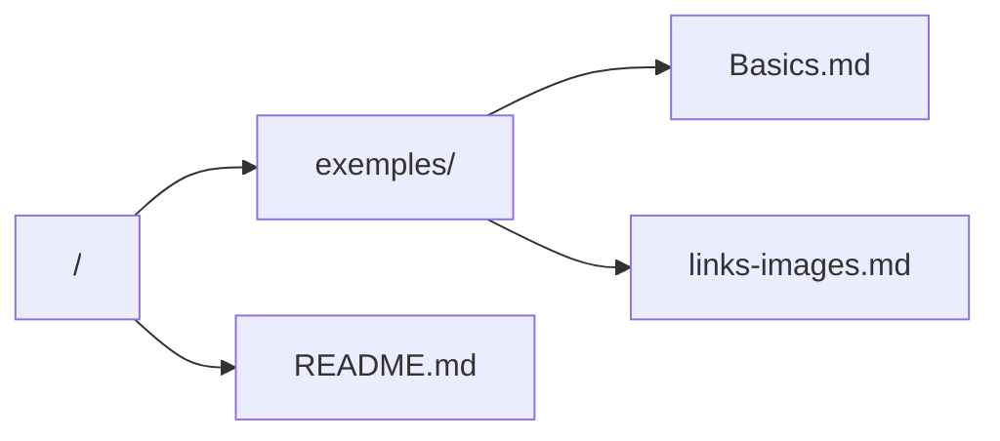

*This project has been created by Florent Cretin.*

<!-- 𝔸 𝔹 ℂ 𝔻 𝔼 𝔽 𝔾 ℍ 𝔾 𝕁 𝕂 𝕃 𝕄 ℕ 𝕆 ℙ ℚ ℝ 𝕊 𝕋 𝕌 𝕍 𝕎 𝕏 𝕐 ℤ -->
<!-- 🗎 🖋 👀 🗣 -->

[TagLinkMd]: links-images.md
[TagReadmeMd]: README.md
[TagMarkdownTutoriale]: https://www.markdowntutorial.com

# 𝕄arkdown Learning Repository

## 🗓 𝕊ummary

- [𝔻escription](#description)
- [𝕆bjectives](#objectives)
- [📁 ℝepository Structure Tree](#repository-structure-tree)
- [🛠 ℝequirements](#requirements)
- [𝕌sage](#usage)
- [𝕃earning Notes](#learning-notes)
- [ℝesources](#resources)
- [🖋 𝔸uthor](#author)

<h2 id="description">𝔻escription</h2>

> This repository is dedicated to **learning, practicing, and documenting Markdown**.

> Its main goal is to serve as a **personal and progressive knowledge base** covering Markdown syntax, best practices, and common use cases, while also acting as a reference that can be reused in future projects.

> The project provides clear and concise examples of Markdown features, focusing on readability, structure, and real-world documentation needs.

<h2 id="objectives">𝕆bjectives</h2>

- Learn Markdown syntax from basics to advanced usage
- Maintain a clean and reusable Markdown reference
- Practice writing clear technical documentation
- Understand how Markdown is rendered across different platforms (GitHub, GitLab, documentation tools)

<h2 id="repository-structure-tree">📁 ℝepository Structure Tree</h2>

<h2 id="requirements">🛠 ℝequirements</h2>

- Any text editor
- A Markdown renderer (GitHub, VS Code preview, [markdownlivepreview](https://markdownlivepreview.com/), [jotbird](https://www.jotbird.com/app), or similar)
- Basic reading comprehension ;)

<h2 id="usage">𝕌sage</h2>

> Open any `.md` file and read it directly on GitHub or through your editor’s Markdown preview.
>
> You are encouraged to modify, extend, and experiment with the files.

<h2 id="learning-notes">𝕃earning Notes</h2>

Each file is written with the following principles:

1. One concept at a time
1. Minimal but clear examples
1. Comments explaining *why* something is written this way
1. [Exercise][TagMarkdownTutoriale]
1.

<h2 id="resources">ℝesources</h2>

### ℝeferences

- [Markdown Tutoriale][TagMarkdownTutoriale]
- 

<h2 id="author">🖋 𝔸uthor</h2>

> All implementation decisions and documentation were written and validated by the project author.
