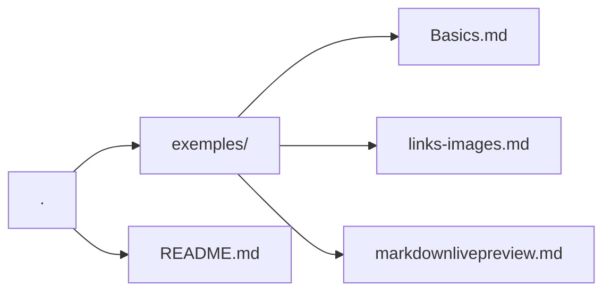

*This project has been created by Florent Cretin.*

[TagLinkMd]: links-images.md
[TagReadmeMd]: README.md
[TagMarkdownTutoriale]: https://www.markdowntutorial.com

# Markdown Learning Repository

## Documentation

- [Description](#description)
- [Objectives](#objectives)
- [Repository Structure Tree](#repository-structure-tree)
- [Requirements](#requirements)
- [Usage](#objectives)
- [Learning Notes](#learning-notes)
- [Resources](#resources)
- [Author](#author)

## Description

> This repository is dedicated to **learning, practicing, and documenting Markdown**.

> Its main goal is to serve as a **personal and progressive knowledge base** covering Markdown syntax, best practices, and common use cases, while also acting as a reference that can be reused in future projects.

> The project provides clear and concise examples of Markdown features, focusing on readability, structure, and real-world documentation needs.

## Objectives

- Learn Markdown syntax from basics to advanced usage
- Maintain a clean and reusable Markdown reference
- Practice writing clear technical documentation
- Understand how Markdown is rendered across different platforms (GitHub, GitLab, documentation tools)

## Repository Structure Tree

## Requirements

- Any text editor
- A Markdown renderer (GitHub, VS Code preview, [markdownlivepreview](https://markdownlivepreview.com/), [jotbird](https://www.jotbird.com/app), or similar)
- Basic reading comprehension ;)

## Usage

Open any `.md` file and read it directly on GitHub or through your editor’s Markdown preview.

You are encouraged to modify, extend, and experiment with the files.

## Learning Notes

Each file is written with the following principles:

- One concept at a time
- Minimal but clear examples
- Comments explaining *why* something is written this way
- [Exercise][TagMarkdownTutoriale]

## Resources

### References

- [Markdown Tutoriale][TagMarkdownTutoriale]
- 

## Author

All implementation decisions and documentation were written and validated by the project author.
